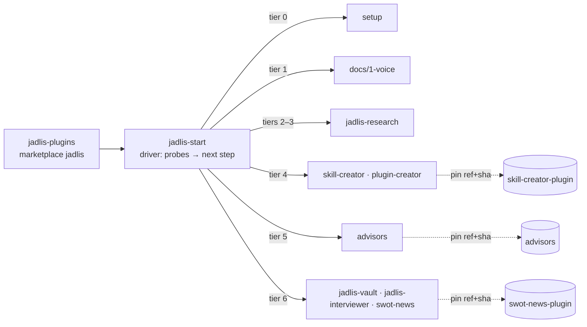

[Русский](README.md) · English

# Jadlis — handing over the stack

Marketplace `jadlis`: one entry point, seven tiers, and a driver that hands you exactly the next step. A Claude Code + Obsidian stack built over a year, transferred one tool at a time — tools first, methodology last.

## Route 0–6

| Tier | What you get | Plugin | Docs |
|---|---|---|---|
| 0 | Workplace: Claude Code, CLI dependencies, an Obsidian folder, a base `CLAUDE.md`, memory, reply style | `setup` | [docs/0-workplace](docs/0-workplace/README.en.md) |
| 1 | Voice: Spokenly, the correction prompt, the replacement dictionary | — | [docs/1-voice](docs/1-voice/README.en.md) |
| 2 | Keys in the Keychain + verif: three models read your plan in isolation | `jadlis-research` | [docs/2-verif](docs/2-verif/README.en.md) |
| 3 | Research: `search`, `full-research` (fourteen channels), `search-paper` | `jadlis-research` | [docs/3-research](docs/3-research/README.en.md) |
| 4 | Your own employees: a skill is a job description | `skill-creator`, `plugin-creator` | [skill-creator-plugin](https://github.com/beCyborg/skill-creator-plugin) |
| 5 | Boards of advisors: eight councils, book lenses, skeptics, a verdict | `advisors` | [advisors](https://github.com/beCyborg/advisors) |
| 6 | Methodology: 6.1 vault → 6.2 interviewer → 6.3 news SWOT | `jadlis-vault`, `jadlis-interviewer`, `swot-news` | [docs/6-methodology](docs/6-methodology/README.en.md) |
| E | Extras on request: browser, desktop, video digests, books, adv-psy | `browser`, `computer-use`, `tldr`, `annas-archive`, `adv-psy` | each repo's README |

The next tier is not handed out until machine probes confirm the previous one. Criteria live in the [driver](plugins/jadlis-start/README.en.md).

## How it works



Internal plugins live in `plugins/<name>`; external ones are wired into the same `marketplace.json` as `url` / `git-subdir` entries pinned by `ref` (release tag) + `sha`. The recipient sees one marketplace; the owner releases each repo separately and bumps the pin in the hub.

## Install

Open Claude Code (desktop or terminal) and paste:

```
You are an installer. Run exactly these steps and nothing else:
1. Bash: claude plugin marketplace add https://github.com/beCyborg/jadlis-plugins.git
2. Bash: claude plugin install jadlis-start@jadlis
3. Tell me: "Send /reload-plugins, then type: JADLIS-BATCH"
```

The same two commands by hand:

```bash
claude plugin marketplace add https://github.com/beCyborg/jadlis-plugins.git
claude plugin install jadlis-start@jadlis
```

The repositories are public — no git credentials or SSH keys needed; the full HTTPS URL is mandatory (the `owner/repo` shorthand is fetched over SSH). From here the driver leads: `JADLIS-BATCH`, `JADLIS-BATCH 0`, … `JADLIS-BATCH 6.3`.

## Plugins

| Plugin | Tier | Source | Install |
|---|---|---|---|
| `jadlis-start` | — | `plugins/jadlis-start` | `claude plugin install jadlis-start@jadlis` |
| `setup` | 0 | `plugins/setup` | `setup@jadlis` |
| `jadlis-research` | 2–3 | `plugins/jadlis-research` | `jadlis-research@jadlis` (installed disabled; enabling asks for keys) |
| `skill-creator`, `plugin-creator` | 4 | [skill-creator-plugin](https://github.com/beCyborg/skill-creator-plugin) | `skill-creator@jadlis`, `plugin-creator@jadlis` |
| `advisors` | 5 | [advisors](https://github.com/beCyborg/advisors) | `advisors@jadlis --config ADVISORS_MEMORY_DIR=~/advisors-memory` |
| `jadlis-vault`, `jadlis-interviewer` | 6.1, 6.2 | `plugins/…` | `jadlis-vault@jadlis`, `jadlis-interviewer@jadlis` |
| `swot-news` | 6.3 | [swot-news-plugin](https://github.com/beCyborg/swot-news-plugin) | `swot-news@jadlis` |
| `browser`, `computer-use` | E | [claude-desktop-plugins](https://github.com/beCyborg/claude-desktop-plugins) | `browser@jadlis`, `computer-use@jadlis` |
| `tldr` | E | [youtube-tldr-plugin](https://github.com/beCyborg/youtube-tldr-plugin) | `tldr@jadlis` |
| `annas-archive` | E | [annas-archive-plugin](https://github.com/beCyborg/annas-archive-plugin) | `annas-archive@jadlis` |
| `adv-psy` | E | [adv-psy-plugin](https://github.com/beCyborg/adv-psy-plugin) | `adv-psy@jadlis --config PSY_MEMORY_DIR=~/adv-psy` |

Plugins deliberately **do not depend** on each other — otherwise installing tier 5 would pull everything at once and the gate would vanish. Current pins of external entries: `python3 tools/bump-pin.py --list`.

## Update

Every plugin carries a semver in `plugin.json`; each release is tagged `<plugin>--v<version>`. For third-party marketplaces **auto-update is off by default on the recipient side**:

```bash
claude plugin update <plugin>@jadlis
```

Or enable auto-update once: `/plugin` → **Marketplaces** → `jadlis`. External plugins update when the owner bumps the pin in the hub — `claude plugin update` sees the new version after that.

## Keys

No key lives in any repository; every recipient registers their own. One standard: **a key is entered once and lives in the macOS Keychain**, never in files. Claude Code asks for MCP-server keys itself when a plugin is enabled (`/plugin configure <plugin>@jadlis` to change them); script keys are written by `/jadlis-research:keys`; scripts read them through `secret.sh`. Details — [docs/2-verif](docs/2-verif/README.en.md).

## Compatibility

- macOS; Claude Code desktop or CLI (Bash is needed for the install). The desktop app **does not install** the `claude` CLI — tier 0 closes that gap.
- Claude Code ≥ 2.1.239 (`git-subdir` with `sha`, `userConfig`, `/plugin configure`).
- Changes — fork + PR ([CONTRIBUTING.md](CONTRIBUTING.md)); commit and release conventions — [CLAUDE.md](CLAUDE.md).

## Migrating from an older install

Older installs need no action: the marketplace name `jadlis` and the URL are unchanged. The command is the same — `JADLIS-BATCH` — but numbers are now tiers 0–6 (old batch 2 = 6.1, batch 3 = 6.2, batch 4 = tiers 2–3). After `claude plugin update jadlis-start@jadlis` the driver rewrites the state journal from probes on its own.

> [!WARNING]
> Plugin and marketplace names are frozen from the first release. Renaming breaks installs; if it ever becomes necessary — only via `renames` in `marketplace.json`, appending a new entry.

## License

MIT — see [LICENSE](LICENSE). `advisors` and `adv-psy` intentionally carry no license — see their `NOTICE.md`.
