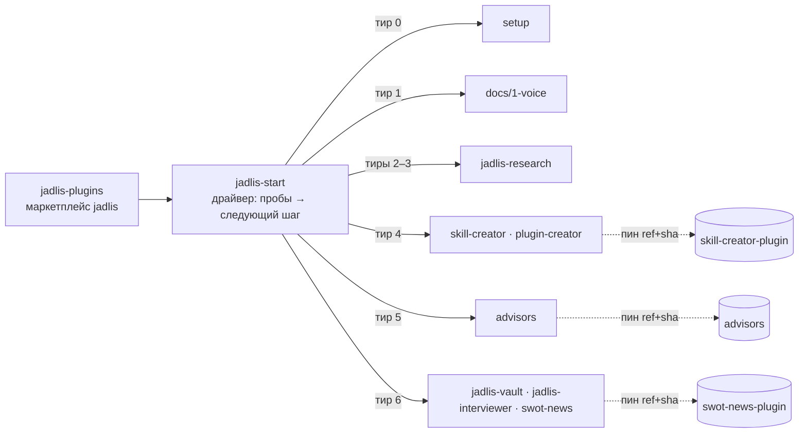

Русский · [English](README.en.md)

# Jadlis — передача стека

Маркетплейс `jadlis`: один вход, семь тиров, драйвер, который выдаёт ровно следующий шаг. Стек Claude Code + Obsidian, собранный за год, передаётся по одному инструменту за раз — инструменты сначала, методология в конце.

## Маршрут 0–6

| Тир | Что получаешь | Плагин | Доки |
|---|---|---|---|
| 0 | Рабочее место: Claude Code, CLI-зависимости, папка Obsidian, базовый `CLAUDE.md`, память, стиль ответов | `setup` | [docs/0-workplace](docs/0-workplace/README.md) |
| 1 | Голос: Spokenly, промпт-корректор, словарь замен | — | [docs/1-voice](docs/1-voice/README.md) |
| 2 | Ключи в Связке ключей + verif: три модели читают твой план порознь | `jadlis-research` | [docs/2-verif](docs/2-verif/README.md) |
| 3 | Ресерч: `search`, `full-research` (четырнадцать каналов), `search-paper` | `jadlis-research` | [docs/3-research](docs/3-research/README.md) |
| 4 | Свои сотрудники: скилл = должностная инструкция | `skill-creator`, `plugin-creator` | [skill-creator-plugin](https://github.com/beCyborg/skill-creator-plugin) |
| 5 | Советы директоров: восемь советов, книжные линзы, скептики, вердикт | `advisors` | [advisors](https://github.com/beCyborg/advisors) |
| 6 | Методология: 6.1 vault → 6.2 интервьюер → 6.3 SWOT новостей | `jadlis-vault`, `jadlis-interviewer`, `swot-news` | [docs/6-methodology](docs/6-methodology/README.md) |
| E | Экстра по запросу: браузер, десктоп, выжимки видео, книги, adv-psy | `browser`, `computer-use`, `tldr`, `annas-archive`, `adv-psy` | README каждого репо |

Следующий тир не выдаётся, пока пробы машины не подтвердят предыдущий. Критерии — в [драйвере](plugins/jadlis-start/README.md).

## Как устроено



Внутренние плагины живут в `plugins/<name>`, внешние подключены к тому же `marketplace.json` записями `url` / `git-subdir` с пином `ref` (тег релиза) + `sha`. Получатель видит один маркетплейс; владелец релизит каждый репо отдельно и поднимает пин в хабе.

## Установка

Открой Claude Code (десктоп или терминал) и вставь:

```
Ты — установщик. Выполни ровно эти шаги и ничего сверх них:
1. Bash: claude plugin marketplace add https://github.com/beCyborg/jadlis-plugins.git
2. Bash: claude plugin install jadlis-start@jadlis
3. Скажи мне: «Отправь /reload-plugins, потом напиши: JADLIS-BATCH»
```

Те же две команды руками:

```bash
claude plugin marketplace add https://github.com/beCyborg/jadlis-plugins.git
claude plugin install jadlis-start@jadlis
```

Репозитории публичные — git-креды и SSH-ключи не нужны; полный HTTPS-URL обязателен (shorthand `owner/repo` тянется по SSH). Дальше всё ведёт драйвер: `JADLIS-BATCH`, `JADLIS-BATCH 0`, … `JADLIS-BATCH 6.3`.

## Плагины

| Плагин | Тир | Откуда | Ставится |
|---|---|---|---|
| `jadlis-start` | — | `plugins/jadlis-start` | `claude plugin install jadlis-start@jadlis` |
| `setup` | 0 | `plugins/setup` | `setup@jadlis` |
| `jadlis-research` | 2–3 | `plugins/jadlis-research` | `jadlis-research@jadlis` (ставится выключенным; включение спрашивает ключи) |
| `skill-creator`, `plugin-creator` | 4 | [skill-creator-plugin](https://github.com/beCyborg/skill-creator-plugin) | `skill-creator@jadlis`, `plugin-creator@jadlis` |
| `advisors` | 5 | [advisors](https://github.com/beCyborg/advisors) | `advisors@jadlis --config ADVISORS_MEMORY_DIR=~/advisors-memory` |
| `jadlis-vault`, `jadlis-interviewer` | 6.1, 6.2 | `plugins/…` | `jadlis-vault@jadlis`, `jadlis-interviewer@jadlis` |
| `swot-news` | 6.3 | [swot-news-plugin](https://github.com/beCyborg/swot-news-plugin) | `swot-news@jadlis` |
| `browser`, `computer-use` | E | [claude-desktop-plugins](https://github.com/beCyborg/claude-desktop-plugins) | `browser@jadlis`, `computer-use@jadlis` |
| `tldr` | E | [youtube-tldr-plugin](https://github.com/beCyborg/youtube-tldr-plugin) | `tldr@jadlis` |
| `annas-archive` | E | [annas-archive-plugin](https://github.com/beCyborg/annas-archive-plugin) | `annas-archive@jadlis` |
| `adv-psy` | E | [adv-psy-plugin](https://github.com/beCyborg/adv-psy-plugin) | `adv-psy@jadlis --config PSY_MEMORY_DIR=~/adv-psy` |

Плагины намеренно **не зависят** друг от друга — иначе установка тира 5 подтянула бы всё сразу и гейт исчез бы. Текущие пины внешних записей: `python3 tools/bump-pin.py --list`.

## Обновление

У каждого плагина в `plugin.json` задан semver, релиз помечен тегом `<plugin>--v<version>`. У сторонних маркетплейсов **auto-update у получателей выключен по умолчанию**:

```bash
claude plugin update <plugin>@jadlis
```

Либо один раз включить auto-update: `/plugin` → **Marketplaces** → `jadlis`. Внешние плагины обновляются, когда владелец поднимает пин в хабе — `claude plugin update` увидит новую версию после этого.

## Ключи

Ни один ключ в репозиториях не лежит; все регистрации получатель заводит свои. Стандарт один: **ключ вводится один раз и живёт в Связке ключей macOS**, не в файлах. Ключи MCP-серверов Claude Code спрашивает сам при включении плагина (`/plugin configure <plugin>@jadlis` — поменять), ключи скриптов пишет `/jadlis-research:keys`; читают их скрипты через `secret.sh`. Подробно — [docs/2-verif](docs/2-verif/README.md).

## Совместимость

- macOS; Claude Code десктоп или CLI (Bash нужен для установки). Десктоп **не ставит** CLI `claude` — тир 0 закрывает это.
- Claude Code ≥ 2.1.239 (`git-subdir` с `sha`, `userConfig`, `/plugin configure`).
- Правки — форк + PR ([CONTRIBUTING.md](CONTRIBUTING.md)); конвенции коммитов и релизов — [CLAUDE.md](CLAUDE.md).

## Миграция со старой установки

Старым установкам ничего делать не нужно: имя маркетплейса `jadlis` и URL сохранены. Команда та же — `JADLIS-BATCH`, но номера теперь тиры 0–6 (старый батч 2 = 6.1, батч 3 = 6.2, батч 4 = тиры 2–3). После `claude plugin update jadlis-start@jadlis` драйвер сам перепишет журнал состояния по пробам.

> [!WARNING]
> Имена плагинов и маркетплейса зафиксированы с первого релиза. Переименование ломает установки; если оно понадобится — только через `renames` в `marketplace.json`, дописывая новую запись.

## Лицензия

MIT — см. [LICENSE](LICENSE). У `advisors` и `adv-psy` лицензии нет намеренно — см. их `NOTICE.md`.
