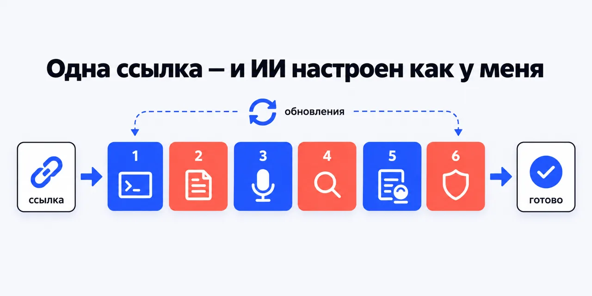
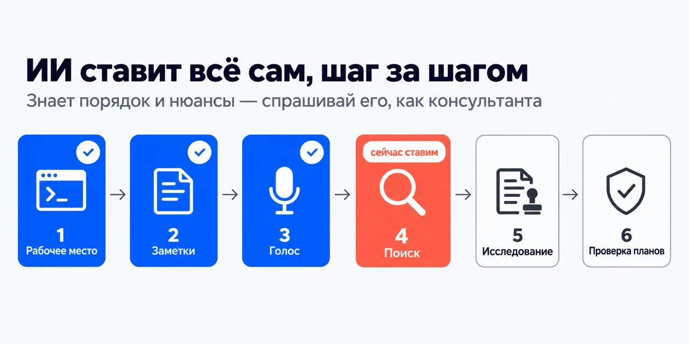
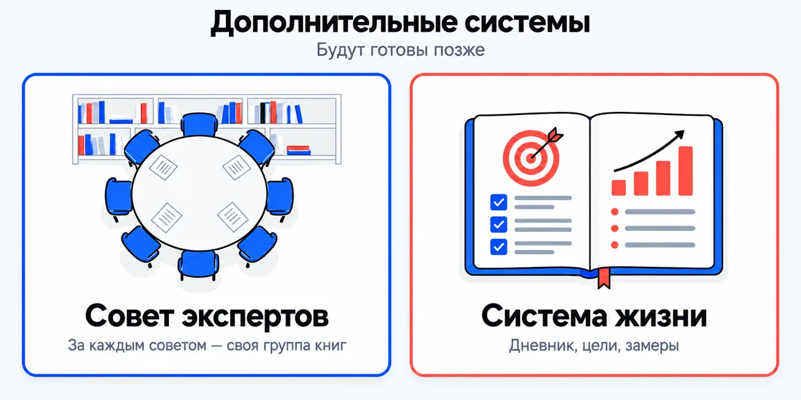
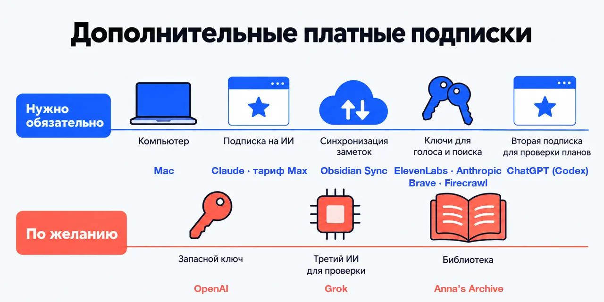

# Помощник по настройке ИИ

**Одна ссылка:** https://github.com/beCyborg/jadlis-hub

Отправь её своему ИИ, и он поставит тебе всё, чем пользуюсь я сам, объяснит, что это и зачем,
и будет получать обновления. Скопируй в чат Claude Code целиком:

```
Ты — установщик. Открой https://github.com/beCyborg/jadlis-hub и действуй по нему.
1. Проверь, что стоит Claude Code и подписка активна; нет — остановись и скажи мне.
2. Выполни дословно: claude plugin marketplace add https://github.com/beCyborg/jadlis-hub
3. Выполни дословно: claude plugin install jadlis-hub@jadlis
4. Напиши в чат /jadlis-hub и покажи мне маршрут со статусами.
Перед каждой командой показывай её целиком и жди моего «да». Мой конфиг не заменяй,
сливай с текущим и показывай каждую правку. Значения ключей не печатай.
Команда вернула ошибку — остановись, покажи вывод, к следующей не переходи.
```

Первая команда ничего не ставит, она добавляет каталог. Дальше ведёт помощник:
объясняет каждый шаг, ставит, проверяет и открывает следующий.

<p align="center">
  
</p>

## Как это происходит

<p align="center">
  
</p>

ИИ ведёт тебя по шагам сам: перед каждым объясняет, что это и зачем, ставит,
проверяет на твоём компьютере, что всё работает, и только потом открывает следующий.
Спрашивай его по ходу, как консультанта.

## Что ИИ поставит по очереди

<p align="center">
  
</p>

**1 · [Рабочее место](https://github.com/beCyborg/jadlis-claudecode).** Claude Code с моими настройками: терминал, папка для заметок,
уведомления. ИИ сразу знает, как со мной работать.
*Зачем:* всё дальнейшее собрано под эту настройку. В ней работает, в другой ломается.

**2 · [Заметки](https://github.com/beCyborg/jadlis-obsidian).** Obsidian с моей конфигурацией. Всё, что ИИ узнаёт и делает,
ложится в заметки, и они остаются твоими.
*Зачем:* память, которая не пропадает вместе с закрытым чатом.

**3 · [Голос](https://github.com/beCyborg/jadlis-voice).** Говоришь вслух, а в поле появляется уже вычищенный текст.
По желанию ИИ читает тебе вслух.
*Зачем:* длинное задание проще сказать, чем набрать.

**4 · [Поиск](https://github.com/beCyborg/jadlis-search).** ИИ ищет в интернете и читает страницы, считая стоимость каждого запроса.
*Зачем:* ответы из сети, а не из памяти модели.

**5 · [Исследование](https://github.com/beCyborg/jadlis-research).** Один вопрос, а в ответ отчёт из 14 источников и [научных статей](https://github.com/beCyborg/jadlis-science-research),
где каждое утверждение перепроверено.
*Зачем:* принять самое эффективное, реалистичное и проверенное решение.

**6 · [Проверка планов](https://github.com/beCyborg/jadlis-verif).** Три разных ИИ ищут дыры в твоём плане до того,
как ты начал его выполнять.
*Зачем:* ошибка в плане не стоит ничего. Ошибку, которую уже сделали,
приходится переделывать целиком. Проверить сначала проще.

## Дополнительные инструменты

<p align="center">
  
</p>

Ставятся в любой момент, независимо от шагов.

- **[Управление твоим браузером](https://github.com/beCyborg/jadlis-browser).** ИИ работает на сайтах, где ты уже залогинен, без передачи паролей.
- **[Управление твоим компьютером](https://github.com/beCyborg/jadlis-computer-use).** ИИ кликает и печатает в обычных программах на Mac.
- **[Скачать книги](https://github.com/beCyborg/jadlis-books).** Любая книга или научная статья находится за минуту.
- **[Выжимка из видео и текста](https://github.com/beCyborg/jadlis-tldr).** Час видео или толстый файл превращается в пять выводов и список действий.
- **[Новости под тебя](https://github.com/beCyborg/jadlis-swot-news).** Каждый день ИИ читает новости и говорит, что из них касается тебя.
- **[Свои сотрудники](https://github.com/beCyborg/jadlis-skill-builder).** Пишешь инструкцию, как для нового работника, и ИИ делает эту
  работу сам. Готового помощника можно [упаковать](https://github.com/beCyborg/jadlis-plugin-creator) и отдать другому человеку.

## Дополнительные системы

<p align="center">
  
</p>

Будут готовы позже.

- **Совет экспертов.** Решение, продукт, продажа, текст, влияние, психология: за каждым
  советом стоит своя группа книг, на выходе один вердикт с аргументами. Девять советов
  уже лежат в этом же каталоге, помощник их пока не ставит.
- **Система жизни.** Дневник, цели и замеры, разложенные под твою жизнь, и интервью,
  из которого рождаются смысл и цели.

## Дополнительные платные подписки

<p align="center">
  
</p>

> [!IMPORTANT]
> Нужен Mac и подписка [Claude](https://claude.ai) на тарифе Max. Без них дальше не заработает,
> лучше узнать это сейчас, а не на третьем шаге.

**Нужно обязательно, по шагам:** [Obsidian Sync](https://obsidian.md/sync) для заметок ·
[ElevenLabs](https://elevenlabs.io) и [Anthropic API](https://console.anthropic.com) для голоса ·
[Brave Search](https://brave.com/search/api/) и [Firecrawl](https://firecrawl.dev) для поиска ·
[ChatGPT](https://chatgpt.com) для проверки планов.
**По желанию:** [OpenAI API](https://platform.openai.com), [Grok](https://x.ai), [Anna’s Archive](https://annas-archive.org).

ИИ называет, что понадобится, до того как что-то поставить. Счета выставляют сами сервисы,
своих цифр я не называю.

<details>
<summary>Список плагинов и команд (для тех, кто хочет подробности)</summary>

Каталог `jadlis`: `https://github.com/beCyborg/jadlis-hub`. Репозиторий и плагин — `jadlis-<имя>`, команда короткая — `/<имя>`; полная форма `/jadlis-<имя>:<имя>` тоже работает.

**Обязательные, по порядку.**

| № | Плагин | Команда | Что даёт |
|---|---|---|---|
| 1 | `jadlis-claudecode` | `/claudecode` | Claude Code, терминал и папка `~/Jadlis` — как у владельца. |
| 2 | `jadlis-obsidian` | `/obsidian` | Хранилище Obsidian: тема, плагины, хоткеи, CLI. |
| 3 | `jadlis-voice` | `/jadlis-voice` | Голосовой контур: диктовка и озвучка. |
| 4 | `jadlis-search` | `/search` | Поиск и ключи — база для обоих ресерчей. |
| 5 | `jadlis-research`, `jadlis-science-research` | `/research`, `/science-research` | Полный ресерч по каналам и отдельно — научная доказательность. |
| 6 | `jadlis-verif` | `/verif` | Три модели рвут план порознь. Конец гейта. |

**Дополнительные, в рекомендованном порядке.**

| Плагин | Команда | Что даёт |
|---|---|---|
| `jadlis-swot-news` | `/swot-news` | Новости как личный SWOT, дельта-выпуск каждый день. |
| `jadlis-tldr` | `/tldr` | Видео и файлы — выжимка и действия. |
| `jadlis-books` | `/books` | Книга или статья за минуту. |
| `jadlis-browser` | `/browser` | Залогиненный браузер: то, что за паролем. |
| `jadlis-computer-use` | `/computer-use` | Нативные приложения macOS. |
| `jadlis-skill-builder` | `/skill-builder` | Свой ИИ-сотрудник: скилл как должностная инструкция. |
| `jadlis-plugin-creator` | `/plugin-creator` | Собрать, проверить и выпустить свой плагин. |


</details>

<details>
<summary>Условия использования, обновление, что проверено</summary>

**Условия использования.** Лицензии нет: все права сохранены за автором. Читать и
пользоваться лично можно. Коммерческое использование, переиздание и включение в свои
продукты — по договорённости со мной.

**Обновление.** У стороннего каталога авто-обновление на твоей стороне выключено:
пока не запустишь первую команду, у тебя остаётся та версия, которую ты поставил.

```
claude plugin marketplace update jadlis
claude plugin update jadlis-hub@jadlis
```

**Проверено там, где я работаю:** мой Mac, моя подписка, мои ключи (macOS 27.0, Claude Code 2.1.267).
На чужих машинах не проверял — если у тебя не встало, напиши в issue этого репозитория.

**Как предложить правку** — [CONTRIBUTING.md](CONTRIBUTING.md).

</details>
