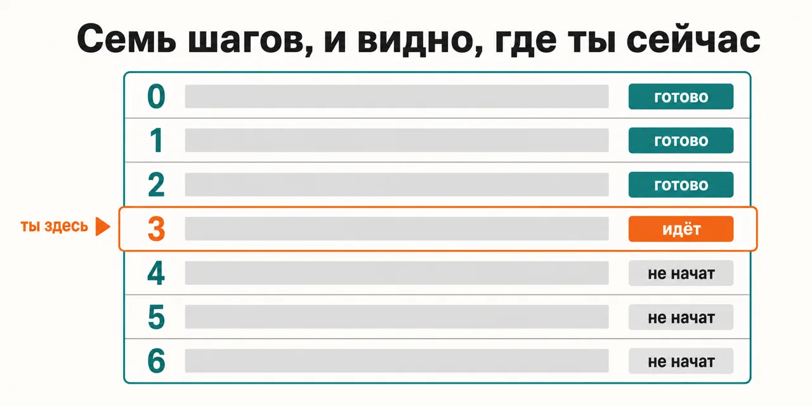
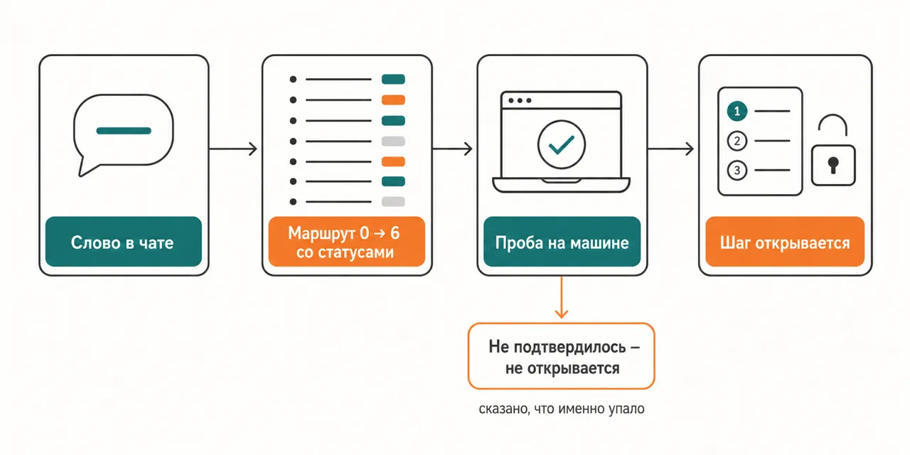

Русский · [English](README.en.md)

# Помощник куплен, а вечер уходит не на работу, а на выяснение, с чего начать

Одна команда в чате показывает маршрут и ту строку, на которой ты стоишь сейчас;
следующий шаг не выдаётся, пока проба на твоей машине не подтвердит предыдущий.

```
claude plugin marketplace add https://github.com/beCyborg/jadlis-hub
claude plugin install jadlis-hub@jadlis
```

Ставится поверх уже настроенного: базовый конфиг сливается с текущим, каждая правка показывается
целиком и ждёт твоего «да», а снимается всё одной командой — `claude plugin uninstall jadlis-hub@jadlis --keep-data`.



Текстом: список из семи шагов, у каждого статус, одна строка помечена «ты здесь» — с неё и
продолжаешь, вспоминать ничего не нужно.

Это моё рабочее место, выложенное как есть, а не продукт: чем перестал пользоваться — убрал.

## Было → стало

| Руками | Чатом с ИИ | Этим плагином |
|---|---|---|
| **Порядок шагов.** Инструментов много, порядка между ними нет: список открываешь и закрываешь, потому что выбирать из двадцати — это тоже работа. | Чат выдаёт все шаги сразу, и выбирать снова тебе. | Пишешь в чат `/jadlis-hub` — шесть обязательных шагов и семь необязательных со статусами и строка «где ты сейчас». |
| **Состояние машины.** На шаге 3 выясняется, что шаг 2 не доехал, и выглядит это как «сломано вообще всё». | Чат верит на слово: сказал «сделал» — идём дальше. | Проба запускается на твоей машине; следующий шаг не выдаётся, пока она не подтвердит предыдущий. |
| **Перерыв в неделю.** Возвращаешься, а где именно остановился — в истории терминала. | Новая сессия не помнит прошлой. | Пишешь то же слово — возвращаешься туда, где остановился, вплоть до подшага. |
| **Ключи от платных сервисов.** Значения кочуют по конфигам и оседают в истории команд. | Диктуешь ключ в переписку, чтобы «он проверил». | Ключи не читаются: проверяется только «есть» или «нет», значения нигде не печатаются. |
| **Уже настроенная машина.** Новый конфиг затирает то, что настраивалось месяцами. | «Заменю файл целиком» — разницу видишь потом. | Базовый конфиг сливается с текущим; сказал «нет» — файл остался как был, остальные шаги идут дальше. |

## Как это работает



На входе — команда `/jadlis-hub` в чате.
Внутри — проба текущего шага прямо на твоей машине: есть ли то, что шагу нужно, и отвечает ли оно.
На выходе — семь строк маршрута со статусами и ровно один следующий шаг.

Текстом: команда в чате → маршрут со статусами → проба на машине → шаг открывается; не
подтвердилось — не открывается, и сказано, что именно упало.

**Обязательная цепочка — за гейтом.** Пока шаг не подтвердился пробой, следующий не выдаётся.

| № | Плагин | Команда | Что даёт |
|---|---|---|---|
| 1 | `jadlis-claudecode` | `/claudecode` | Claude Code, терминал и папка `~/Jadlis` — как у владельца. |
| 2 | `jadlis-obsidian` | `/obsidian` | Хранилище Obsidian: тема, плагины, хоткеи, CLI. |
| 3 | `jadlis-voice` | `/jadlis-voice` | Голосовой контур: диктовка и озвучка. |
| 4 | `jadlis-search` | `/search` | Поиск и ключи — база для обоих ресерчей. |
| 5 | `jadlis-research`, `jadlis-science-research` | `/research`, `/science-research` | Полный ресерч по каналам и отдельно — научная доказательность. |
| 6 | `jadlis-verif` | `/verif` | Три модели рвут план порознь. Конец гейта. |

**Необязательные — в рекомендованном порядке.** Ставится то, до чего дошёл.

| Плагин | Команда | Что даёт |
|---|---|---|
| `jadlis-swot-news` | `/swot-news` | Новости как личный SWOT, дельта-выпуск каждый день. |
| `jadlis-tldr` | `/tldr` | Видео и файлы — выжимка и действия. |
| `jadlis-books` | `/books` | Книга или статья за минуту. |
| `jadlis-browser` | `/browser` | Залогиненный браузер: то, что за паролем. |
| `jadlis-computer-use` | `/computer-use` | Нативные приложения macOS. |
| `jadlis-skill-builder` | `/skill-builder` | Свой ИИ-сотрудник: скилл как должностная инструкция. |
| `jadlis-plugin-creator` | `/plugin-creator` | Собрать, проверить и выпустить свой плагин. |

Имена читаются по одному правилу: репозиторий и плагин — `jadlis-<имя>`, команда короткая —
`/<имя>`; полная форма `/jadlis-<имя>:<имя>` тоже работает.

**Позже.** Девять советов директоров, собранных из книг, уже лежат в этом же маркетплейсе под
текущими именами: `advisor-decision`, `advisor-product`, `advisor-influence`, `advisor-sales`,
`advisor-copywriting`, `advisor-psychologist`, `robert-greene`, `nupp`, `cognitive-biases`. Их
переделка — имена, структура, тексты — следующий план, и помощник маршрута их пока не ставит.
За советами идёт `jadlis-os`: методология хранилища (потребности, метрики, цели, перезапуски дня
и недели) плюс интервьюер; репозитории пока приватные.

## Установка и первый запуск

**а) Первый экран — один плагин.** Три строки, больше на входе ничего не нужно:

```
claude plugin marketplace add https://github.com/beCyborg/jadlis-hub
claude plugin install jadlis-hub@jadlis
/jadlis-hub
```

Первая строка ничего не ставит — добавляет маркетплейс. Вторая ставит один плагин, помощника
маршрута. Третья — команда со слэшем в чате Claude Code: она открывает маршрут, возвращает в него
после перерыва и повторяется в конце каждого ответа, искать её в переписке не придётся.

Дальше помощник ведёт по шагам. Каждый шаг — отдельный плагин со своей короткой командой, он
ставится по ходу маршрута; заранее ставить ничего не нужно.

**б) Текст для вставки агенту.** Скопируй целиком в чат Claude Code:

```
Ты — установщик. Поставь на этот Mac плагин jadlis-hub из маркетплейса jadlis.
Сначала проверь, что стоит Claude Code и подписка активна; если нет — остановись и скажи об этом.
Дальше выполни ровно эти команды, дословно, ничего не сокращая:
1. claude plugin marketplace add https://github.com/beCyborg/jadlis-hub
2. claude plugin install jadlis-hub@jadlis
3. claude plugin list — покажи мне строку про jadlis-hub и его версию.
Потом отправь в чат команду /jadlis-hub и покажи мне маршрут со статусами.
Перед каждой командой покажи её мне целиком и дождись «да». Сказал «нет» — не выполняй,
файл оставь как был, скажи, что пропустил, и иди дальше.
Мой конфиг не заменяй, а сливай с текущим; каждую правку показывай целиком.
Ключи у меня не спрашивай: на этом шаге они не нужны. Значения ключей не печатай.
Команда вернула ошибку — остановись, покажи вывод, к следующей не переходи.
```

**в) Проверка.** `claude plugin list` — в списке должна быть строка про `jadlis-hub` с версией.
Открывай Claude Code в той папке, где работаешь.

Первый шаг маршрута — рабочее место: маршрут сам поставит `jadlis-claudecode@jadlis` и передаст
управление его команде `/claudecode`.

## Границы, стоимость, обновление

**Чего не делает.** Не читает значения твоих ключей — только проверяет, заведены они или нет.
Не заводит за тебя подписки и не платит за них. Не решает, какой инструмент из каталога тебе
нужен: маршрут показывает порядок, выбор твой. Не выдаёт следующий шаг на веру — и не из
вредности: без ключей поздний шаг у тебя не заработает, и ты решишь, что сломано вообще всё.

**Что нужно.** Mac и активная подписка Claude Code. Нет одного из двух — дальше не заработает;
лучше узнать это сейчас, чем на третьем шаге. Проверено на macOS 27.0 и Claude Code 2.1.263;
ниже этих версий не проверял.

**За что придётся платить.** Сказано здесь, до установки, а не на середине маршрута. Цен не
называю — смотри на странице провайдера.

| Шаг | За что платишь |
|---|---|
| 1. Рабочее место | Подписка Claude **Max**: в поставляемых настройках стоит `model: opus[1m]`, и на Pro Opus с окном 1M расходует usage-кредиты. |
| 2. Obsidian | Obsidian Sync, если нужна синхронизация между устройствами. |
| 3. Голос | ElevenLabs + Anthropic API; OpenAI API — по желанию. |
| 4. Поиск | Brave Search API + Firecrawl. |
| 5–6. Ресерч и проверка | Подписка ChatGPT (Codex CLI); Grok — по желанию. |
| Книги (необязательный) | Членство в Архиве Анны. |

**Каталог.** Маршрут ведёт по остальным 20 репозиториям витрины: каждый ставится своей командой,
единой кнопки «поставить всё» нет и не будет — ставится то, до чего ты дошёл. Доки к каждому шагу
лежат в его собственном репозитории `jadlis-*`, файл `docs/tier/README.md`.

**Порядок расхода токенов.** Сам маршрут лёгкий: он спрашивает, проверяет и печатает таблицу.
Тяжёлое начинается там, куда маршрут приводит: тяжёлый прогон — десятки субагентов из твоей
квоты, и такие шаги маршрут называет заранее. Во что это обходится в деньгах — не мерил и цифру
не назову.

**Проверено там, где я работаю:** мой Mac, моя подписка, мои ключи. На чужих машинах не
проверял — если у тебя не встало, напиши в issue репозитория.

**Условия использования.** Лицензии нет: все права сохранены за автором. Читать и
пользоваться лично можно. Коммерческое использование, переиздание и включение в свои
продукты — по договорённости со мной.

**Обновление.** У стороннего маркетплейса авто-обновление на твоей стороне выключено: пока не
запустишь первую команду, у тебя остаётся та версия, которую ты поставил.

```
claude plugin marketplace update jadlis
claude plugin update jadlis-hub@jadlis
claude plugin list
```

Переустановка, если что-то встало криво:

```
claude plugin uninstall jadlis-hub@jadlis --keep-data && claude plugin install jadlis-hub@jadlis
```
