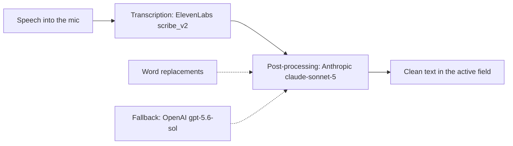

[Русский](README.md) · English

# Tier 1 — Voice

Dictation instead of typing: speech is transcribed, a second model strips the "uhh"s and filler, and the clean text lands straight in the field your cursor is in.
No plugin here — Spokenly is set up by hand, before Claude Code is installed.

## Why

Nobody types a long prompt by hand — the thought breaks mid-sentence.

- Problem: the more it costs to say something, the shorter the task you give the agent — and the worse the result.
- What it does: speech → clean text with punctuation, no hesitations, no filler words, meaning untouched.
- Why this tier comes first: every later tier is a conversation with an agent. Voice makes that conversation cheap.

## What it looks like

Speech goes through two cloud steps and comes back as text in the field your cursor is in.



<details>
<summary>Before / after example (synthetic)</summary>

**Before — raw STT output:**

> so like I want you to uhh look at our notes folder and, you know, find every file that has no heading, and basically maaake a list, I mean just a list, don't change anything yet

**After — what lands in the field:**

> I want you to look at our notes folder and find every file that has no heading, and make a list. Just a list, don't change anything yet.

Meaning, tone and the "yet" survive; the hesitations, "like", "basically" and the stretched vowel are gone.

</details>

## Install

Manual path — there is no plugin for this tier.

1. Create three accounts and grab an API key from each: **ElevenLabs** (transcription), **Anthropic Console** (post-processing), **OpenAI Platform** (post-processing fallback). Each needs a minimum balance top-up.
2. Install **Spokenly** (macOS) → Settings → providers: ElevenLabs — Base URL `https://api.elevenlabs.io`, model `scribe_v2`; Anthropic — model `claude-sonnet-5`; OpenAI — Base URL `https://api.openai.com`, model `gpt-5.6-sol`.
3. Apply the settings from the table below.
4. Settings → Prompts → create a single prompt named "Промпт": provider Anthropic, temperature `0.2`, mode `autoInsert`, body copied whole from [prompt.txt](prompt.txt).
5. Settings → Word Replacements (plain "from → to" mode, no regex) → add the pairs from [replacements.json](replacements.json).

| Setting | Value |
|---|---|
| Transcription model | `elevenlabs-api` (`scribe_v2`) |
| AI post-processing | Anthropic → `claude-sonnet-5` |
| Post-processing fallback | OpenAI → `gpt-5.6-sol` |
| Temperature · Reasoning effort | `0.2` · `none` |
| Insert mode · Clipboard | `autoInsert` · auto-copy off |
| History retention · Recording indicator | 1 month · panel |

Check that the tier is closed (the probe prints only lengths and counts, never key values):

```bash
P="$HOME/Library/Containers/app.spokenly/Data/Library/Preferences/app.spokenly.plist"
mp=$(plutil -extract mainPrompt      raw -o - "$P" 2>/dev/null)
ap=$(plutil -extract aiProviders     raw -o - "$P" 2>/dev/null | base64 -d 2>/dev/null \
      | python3 -c 'import json,sys;print(len(json.load(sys.stdin)))' 2>/dev/null)
wr=$(plutil -extract wordReplacements raw -o - "$P" 2>/dev/null | base64 -d 2>/dev/null \
      | python3 -c 'import json,sys;print(len(json.load(sys.stdin)))' 2>/dev/null)
echo "prompt_chars=${#mp} providers=${ap:-0} replacements=${wr:-0}"
```

The tier is closed when the prompt is non-empty, providers ≥ 2, replacements ≥ 1. The `jadlis-start` driver runs the same probe (`skills/batch/references/детект-состояния.md`).

If Claude Code is already installed, hand the check to the agent — paste this block:

```text
You are a checker. Do exactly these steps and nothing beyond them:
1. Bash: run the check block from docs/1-voice/README.en.md (plutil against the Spokenly plist).
2. Tell me in one line: is tier 1 closed or not, and what is missing.
Change nothing. Do not open or print the plist itself — my API keys live in it.
```

## Usage

Assign a dictation hotkey in Spokenly — that is the single key you press every day.

1. **A long task for the agent.** Cursor in the Claude Code input → hotkey → say the whole context out loud → read it over → send.
2. **A thought on the move.** Cursor in an Obsidian daily note → hotkey → the text arrives already edited.
3. **STT keeps mishearing a word.** Add a "heard → written" pair in Word Replacements. That is how the dictionary grows: your projects, your tools, your names.

Done means: dictate two sentences full of "like" and "uhh" — the hesitations are gone, the meaning is intact.

## Limits and cost

Three paid sign-ups; every key is your own, on your own accounts.

- **Pay-as-you-go** on all three: ElevenLabs, Anthropic, OpenAI. No subscription, but each needs a minimum top-up.
- **Spokenly stores its keys in plain text inside its plist.** Never forward that file, never put it in a repo, never let an agent read it. This is the exception to the shared key-storage standard (macOS Keychain, tier 2): Spokenly offers no Keychain path of its own.
- **Everything goes to the cloud:** speech to ElevenLabs, text to Anthropic (OpenAI as fallback). This route does not work offline; do not dictate anything you cannot send out.
- **macOS only.** Spokenly exists nowhere else.
- **What it does not do:** no translation, no summarizing, no cutting more than a third of the words. Misheard names are fixed only by the replacement dictionary.

Settings, prompt and dictionary were checked against the batch 1 instruction of the "Передача" package (2026-09-06). One pair naming a private project was removed from the dictionary — you add your own names as you go.
