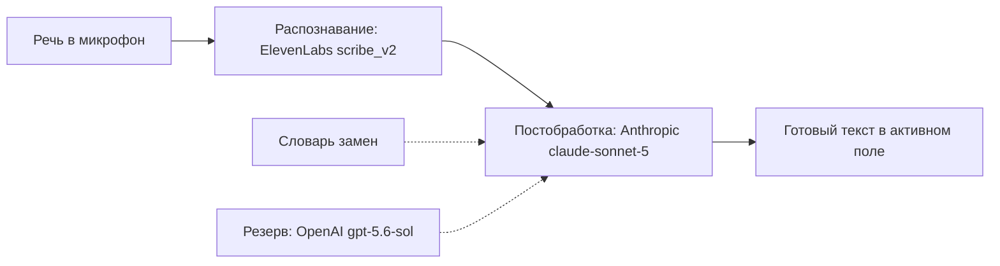

Русский · [English](README.en.md)

# Тир 1 — Голос

Диктовка вместо клавиатуры: речь распознаётся, вторая модель чистит текст от «э-э-э» и мусора, готовое падает прямо в активное поле.
Плагина здесь нет — Spokenly настраивается руками, до установки Claude Code.

## Зачем

Длинный промпт руками не набирают — мысль обрывается на середине фразы.

- Проблема: чем дороже сказать, тем короче задание агенту — и тем хуже результат.
- Что делает: речь → чистый текст с пунктуацией, без хезитаций и слов-паразитов, без пересказа смысла.
- Почему тир первый: все следующие тиры — это разговор с агентом. Голос делает разговор дешёвым.

## Как выглядит

Речь проходит два облачных шага и возвращается текстом в то поле, где стоит курсор.



<details>
<summary>Пример «до / после» (синтетический)</summary>

**До — как услышал STT:**

> ну вот я это, хочу чтобы ты э-э-э посмотрел на нашу папку с заметками и там, как бы, нашёл все файлы где нет заголовка, и в общем сделааал список, ну то есть просто список, ничего не меняй пока

**После — что попало в поле:**

> Хочу, чтобы ты посмотрел на нашу папку с заметками и нашёл все файлы, где нет заголовка, и сделал список. Просто список, ничего не меняй пока.

Смысл, обращение и «пока» на месте; ушли хезитации, «как бы», «в общем» и удлинение гласной.

</details>

## Как поставить

Ручной путь — плагина для этого тира нет.

1. Заведи три аккаунта и забери по API-ключу: **ElevenLabs** (распознавание), **Anthropic Console** (постобработка), **OpenAI Platform** (резерв постобработки). Каждый требует минимального пополнения баланса.
2. Поставь **Spokenly** (macOS) → Settings → провайдеры: ElevenLabs — Base URL `https://api.elevenlabs.io`, модель `scribe_v2`; Anthropic — модель `claude-sonnet-5`; OpenAI — Base URL `https://api.openai.com`, модель `gpt-5.6-sol`.
3. Выстави настройки по таблице ниже.
4. Settings → Prompts → создай один промпт с именем «Промпт»: провайдер Anthropic, температура `0.2`, режим `autoInsert`, тело — целиком из [prompt.txt](prompt.txt).
5. Settings → Word Replacements (режим «до и после», без regex) → внеси пары из [replacements.json](replacements.json).

| Настройка | Значение |
|---|---|
| Модель распознавания | `elevenlabs-api` (`scribe_v2`) |
| Постобработка AI | Anthropic → `claude-sonnet-5` |
| Резервный провайдер постобработки | OpenAI → `gpt-5.6-sol` |
| Температура · Reasoning effort | `0.2` · `none` |
| Режим вставки · Буфер обмена | `autoInsert` · копирование выкл |
| Хранение истории · Индикатор записи | 1 месяц · панель |

Проверить, что тир закрыт (проба печатает только длины и счётчики, не значения ключей):

```bash
P="$HOME/Library/Containers/app.spokenly/Data/Library/Preferences/app.spokenly.plist"
mp=$(plutil -extract mainPrompt      raw -o - "$P" 2>/dev/null)
ap=$(plutil -extract aiProviders     raw -o - "$P" 2>/dev/null | base64 -d 2>/dev/null \
      | python3 -c 'import json,sys;print(len(json.load(sys.stdin)))' 2>/dev/null)
wr=$(plutil -extract wordReplacements raw -o - "$P" 2>/dev/null | base64 -d 2>/dev/null \
      | python3 -c 'import json,sys;print(len(json.load(sys.stdin)))' 2>/dev/null)
echo "промпт_символов=${#mp} провайдеров=${ap:-0} замен=${wr:-0}"
```

Тир закрыт, когда промпт непустой, провайдеров ≥ 2, замен ≥ 1. Ту же пробу гоняет драйвер `jadlis-start` (`skills/batch/references/детект-состояния.md`).

Если Claude Code уже стоит, эту проверку можно отдать агенту — блок для вставки:

```text
Ты — проверяющий. Выполни ровно эти шаги и ничего сверх них:
1. Bash: запусти блок проверки из docs/1-voice/README.md (plutil по plist Spokenly).
2. Скажи мне одной строкой: тир 1 закрыт или нет и чего не хватает.
Ничего не меняй. Сам plist не открывай и не показывай — в нём лежат мои ключи.
```

## Как пользоваться

Назначь в Spokenly горячую клавишу для диктовки — это единственная кнопка, которой пользуешься каждый день.

1. **Длинное задание агенту.** Курсор в поле ввода Claude Code → шорткат → говоришь весь контекст вслух → перечитываешь глазами → отправляешь.
2. **Мысль на ходу.** Курсор в дневной заметке Obsidian → шорткат → текст ложится сразу отредактированным.
3. **STT стабильно врёт на слове.** Добавляешь пару «слышит → пишет» в Word Replacements. Так словарь и растёт: своими проектами, инструментами, фамилиями.

Критерий, что всё работает: диктуешь два предложения с «ну» и «э-э-э» — хезитации ушли, смысл остался.

## Границы и стоимость

Три платных регистрации, все ключи — твои собственные, на твоих аккаунтах.

- **Оплата по факту** (pay-as-you-go) у всех трёх: ElevenLabs, Anthropic, OpenAI. Подписки нет, но минимальное пополнение нужно на каждом.
- **Ключи Spokenly лежат в его plist открытым текстом.** Не пересылай этот файл, не клади в репозиторий и не давай агенту его читать. Это исключение из общего стандарта хранения ключей (Связка ключей macOS, тир 2): своего Keychain-канала Spokenly не даёт.
- **Всё уходит в облако:** речь — в ElevenLabs, текст — в Anthropic (резерв — OpenAI). Без интернета этот маршрут не работает; чувствительное вслух не диктуй.
- **Только macOS.** Spokenly существует только там.
- **Не делает:** не переводит, не пересказывает, не сокращает больше чем на треть. Ошибки распознавания на именах лечатся только словарём замен.

Значения настроек, промпт и словарь сверены с инструкцией батча 1 пакета «Передача» (06.09.2026). Из словаря убрана одна пара с именем личного проекта — свои имена добавляются по ходу.
