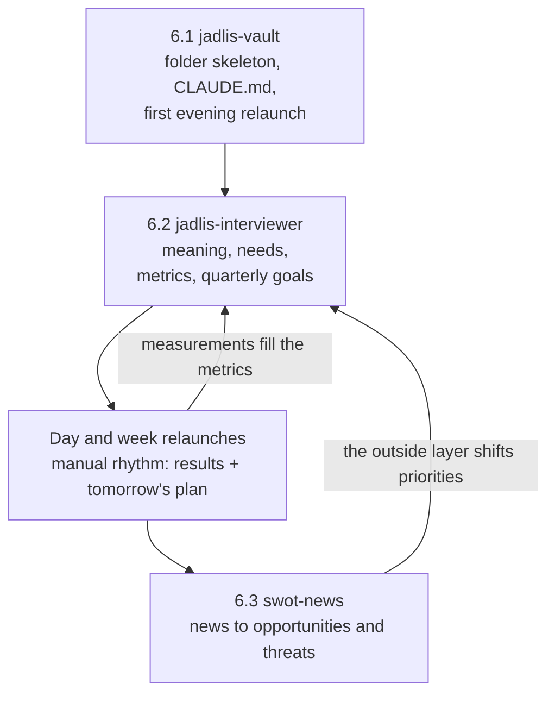

[Русский](README.md) · English

# Tier 6 — the Jadlis methodology

One folder where the meaning of your life, measurable needs, quarterly goals and the news all meet.
Three plugins: `jadlis-vault` (6.1), `jadlis-interviewer` (6.2), `swot-news` (6.3).

## Why

The answers about your own life sit in three separate places — your head, your task tracker and your notes to self. None of them is checkable: "seems fine" cannot be compared with last month, nor handed to an agent.

Tier 6 puts them into plain files and fixes the order of inheritance — every layer rests on the one above:

- **Meaning of life** — decide what counts as winning before you start playing.
- **Needs with metrics** — translate that meaning into numbers with target bands.
- **Quarterly goals** — two or three, each tied to a metric and to the date you honestly drop it.
- **Day and week relaunches** — the review rhythm; without it the system becomes a dead document.
- **News SWOT** — the outside layer: which world events actually touch you.

Remove the top layer and the ones below hang in the air: a goal without a metric cannot be checked, a metric without meaning cannot be prioritised.

## What it looks like

Three handover steps, plus the feedback loop from news back into goals:




<details>
<summary>What the folder holds after the three steps (synthetic example)</summary>

```text
My-vault/
├── CLAUDE.md                    ← reading and writing rules for the agent (6.1)
├── Смысл жизни.md               ← 5–15 sentences in your own words (6.2)
├── Потребности/
│   ├── Потребности.md
│   ├── Движение/
│   │   ├── Движение.md
│   │   └── Тренировок в неделю.md
│   └── Кандидаты в метрики.md
├── Цели/
│   └── 2026-Q3/
│       └── Вернуть регулярный спорт.md
├── Периоды/День/
│   └── 2026-09-06.md            ← the day's results and tomorrow's plan
├── Знания/{Входящие,Ресерчи}/
└── SWOT/                        ← card base and issues (6.3)
    ├── Контекст.md
    ├── Возможности/  Угрозы/  Силы/  Слабости/
    └── Выпуски/SWOT_2026-09-06.md
```

Folder and note names are Russian by design — the vault is written in Russian. A metric note looks like this:

```markdown
---
type: metric
need_name: "Движение"
frequency: weekly
direction: up
red: "< 1"
yellow: "1–2"
green: "> 2"
status:
last_value:
---

## Диапазоны

🔴 less than 1 — the week fell through
🟡 1–2 — holding on
🟢 more than 2 — normal
```

</details>

## Install

Paste this block to an agent in Claude Code opened in the vault folder:

```text
You are an installer. Do exactly these steps and nothing beyond them:
1. Bash: claude plugin marketplace add https://github.com/beCyborg/jadlis-plugins.git
2. Bash: claude plugin install jadlis-start@jadlis
3. Tell me in one line: "Send /reload-plugins, then write: JADLIS-BATCH 6"
Do not read, create or install anything else.
```

From there the driver leads on its own and never hands out the next sub-step until machine probes confirm the previous one:

| Sub-step | Install command | Run after `/reload-plugins` | Closed when |
|---|---|---|---|
| 6.1 | `claude plugin install jadlis-vault@jadlis` | `/jadlis-vault:vault-setup` | `CLAUDE.md` exists and there is ≥ 1 daily note |
| 6.2 | `claude plugin install jadlis-interviewer@jadlis` | `/jadlis-interviewer:vault-interviewer` | meaning note exists, ≥ 10 metrics, ≥ 2 quarterly goals |
| 6.3 | `claude plugin install swot-news@jadlis` | `/swot-news:setup`, then `/swot-news:daily` | plugin installed and ≥ 1 note in the `SWOT` folder |

The manual path is the same three commands in a row, without the driver. The full HTTPS marketplace URL is required: the short `owner/repo` form expands to an SSH address, and a new user usually has no SSH key.

## Usage

Three typical scenarios:

1. **The whole first pass** — `JADLIS-BATCH 6`. The driver installs each plugin and walks you through 6.1 → 6.2 → 6.3.
2. **Return to an abandoned interview** — `/jadlis-interviewer:vault-interviewer`. The skill inspects the vault and resumes at the unfinished stage instead of starting over.
3. **Daily news issue** — `/swot-news:daily`. If the batch has not moved, no issue is written and a single line goes to the chat.

## Limits and cost

What the tier does not do, and what it needs:

- **SWOT is useless without context.** `swot-news` filters news against a summary of your situation (a ceiling of roughly 300 lines), and that summary comes from notes created in 6.2. Before the interviewer the issue is noise.
- **Auto-collected relaunches are on request.** Pulling the day's facts from TickTick, Timing and Health Auto Export does not ship as a plugin: there is no `jadlis-rituals` plugin yet. The manual evening relaunch is set up by `/jadlis-vault:vault-setup`; keeping the rhythm is on the person.
- **No API keys are required.** Kagi News is a public API with no key; the data is CC BY-NC 4.0 and attribution is inserted into every issue footer automatically.
- **What you need up front:** Claude Code, a folder for the vault, and Python 3.9+ for 6.3 (standard library only). Obsidian is optional — without it `swot-news` writes plain Markdown and `vault-setup` skips the CSS snippet.
- **Nothing leaves the machine.** All notes stay as local files; the plugins publish and sync nothing.
