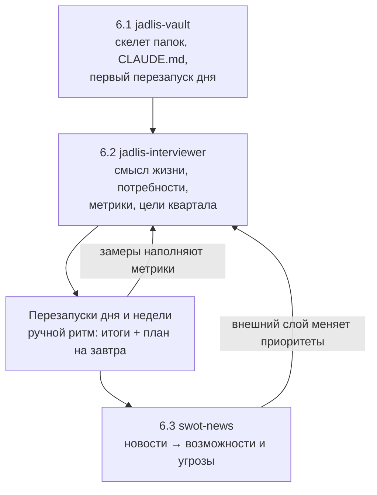
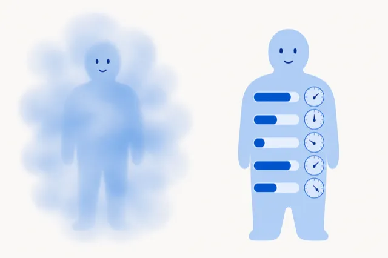

Русский · [English](README.en.md)

# Тир 6 — методология Jadlis

Одна папка, в которой сходятся смысл жизни, измеримые потребности, цели квартала и новости.
Три плагина: `jadlis-vault` (6.1), `jadlis-interviewer` (6.2), `swot-news` (6.3).

## Зачем

Ответы о собственной жизни лежат в трёх разных местах — в голове, в трекере и в переписке с самим собой. Ни один не проверяем: «вроде нормально» нельзя ни сравнить с прошлым месяцем, ни передать агенту.

Тир 6 складывает их в обычные файлы и задаёт порядок наследования — каждый слой опирается на предыдущий:

- **Смысл жизни** — что считать победой, до того как начнёшь играть.
- **Потребности с метриками** — перевод смысла в числа с целевыми диапазонами.
- **Цели квартала** — 2–3 штуки, каждая привязана к метрике и к дате, когда её честно снимают.
- **Перезапуски дня и недели** — ритм проверки; без него система превращается в мёртвый документ.
- **SWOT новостей** — внешний слой: что из случившегося в мире касается лично тебя.

Убери верхний слой — нижние повиснут в воздухе: цель без метрики не проверяема, метрика без смысла не приоритезируема.

## Как выглядит

Три шага передачи и обратная связь от новостей к целям:







<details>
<summary>Что лежит в папке после трёх шагов (синтетический пример)</summary>

```text
Мой-vault/
├── CLAUDE.md                    ← правила чтения и записи для агента (6.1)
├── Смысл жизни.md               ← 5–15 предложений своими словами (6.2)
├── Потребности/
│   ├── Потребности.md
│   ├── Движение/
│   │   ├── Движение.md
│   │   └── Тренировок в неделю.md
│   └── Кандидаты в метрики.md
├── Цели/
│   └── 2026-Q3/
│       └── Вернуть регулярный спорт.md
├── Периоды/День/
│   └── 2026-09-06.md            ← итоги дня и план на завтра
├── Знания/{Входящие,Ресерчи}/
└── SWOT/                        ← база карточек и выпуски (6.3)
    ├── Контекст.md
    ├── Возможности/  Угрозы/  Силы/  Слабости/
    └── Выпуски/SWOT_2026-09-06.md
```

Заметка метрики выглядит так:

```markdown
---
type: metric
need_name: "Движение"
frequency: weekly
direction: up
red: "< 1"
yellow: "1–2"
green: "> 2"
status:
last_value:
---

## Диапазоны

🔴 меньше 1 — неделя выпала
🟡 1–2 — держусь
🟢 больше 2 — норма
```

</details>

## Как поставить

Вставь этот блок агенту в Claude Code, открытом в папке vault:

```text
Ты — установщик. Выполни ровно эти шаги и ничего сверх них:
1. Bash: claude plugin marketplace add https://github.com/beCyborg/jadlis-plugins.git
2. Bash: claude plugin install jadlis-start@jadlis
3. Скажи мне одной строкой: «Отправь /reload-plugins, потом напиши: JADLIS-BATCH 6»
Ничего не читай, не создавай и не ставь помимо этого.
```

Дальше драйвер ведёт сам и не выдаёт следующий подшаг, пока пробами машины не подтвердит предыдущий:

| Подшаг | Команда установки | Что запускать после `/reload-plugins` | Подшаг закрыт, когда |
|---|---|---|---|
| 6.1 | `claude plugin install jadlis-vault@jadlis` | `/jadlis-vault:vault-setup` | есть `CLAUDE.md` и ≥ 1 дневная заметка |
| 6.2 | `claude plugin install jadlis-interviewer@jadlis` | `/jadlis-interviewer:vault-interviewer` | есть «Смысл жизни», ≥ 10 метрик, ≥ 2 цели квартала |
| 6.3 | `claude plugin install swot-news@jadlis` | `/swot-news:setup`, затем `/swot-news:daily` | плагин стоит и есть ≥ 1 заметка в папке `SWOT` |

Ручной путь — те же три команды подряд, без драйвера. Полный HTTPS-URL маркетплейса обязателен: короткая форма `owner/repo` разворачивается в SSH-адрес, а SSH-ключа у нового пользователя обычно нет.

## Как пользоваться

Три типовых сценария:

1. **Первый проход целиком** — `JADLIS-BATCH 6`. Драйвер сам ставит нужный плагин и ведёт по 6.1 → 6.2 → 6.3.
2. **Вернуться к брошенному интервью** — `/jadlis-interviewer:vault-interviewer`. Скилл смотрит, что уже в vault, и продолжает с незакрытого этапа, а не начинает заново.
3. **Ежедневный выпуск новостей** — `/swot-news:daily`. Батч не обновился — выпуск не создаётся, в чат уходит одна строка.

## Границы и стоимость

Что тир не делает и чего требует:

- **SWOT без контекста бесполезен.** `swot-news` отбирает новости по сводке твоего положения (потолок ~300 строк), а она собирается из заметок, которые появляются на 6.2. До интервьюера выпуск будет шумом.
- **Перезапуски с автосбором — по запросу.** Сбор фактов дня из TickTick, Timing и Health Auto Export отдельным плагином не поставляется: плагина `jadlis-rituals` пока нет. Ручной вечерний перезапуск ставит `/jadlis-vault:vault-setup`, дальше ритм держит человек.
- **Ключей тир не требует.** Kagi News — публичный API без ключа; данные под CC BY-NC 4.0, атрибуция вставляется в футер каждого выпуска автоматически.
- **Что нужно заранее:** Claude Code, папка под vault, Python 3.9+ для 6.3 (только стандартная библиотека). Obsidian необязателен — без него `swot-news` пишет обычный Markdown, а `vault-setup` пропускает CSS-сниппет.
- **Наружу ничего не уходит.** Все заметки остаются локальными файлами; плагины ничего не публикуют и не синхронизируют.
