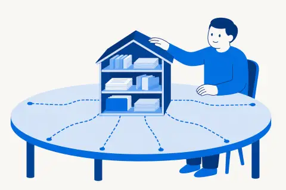

[Русский](README.md) · English

# jadlis-hub — the route helper

One plugin that knows where you are and hands you exactly the next step. Nothing in advance.

## Why

A stack of a dozen plugins cannot be installed in one evening without drowning. The helper walks you through six mandatory steps (workplace, Obsidian, voice, search, research, plan checking) and only then opens the optional tools in a recommended order. The next step is not handed out until machine probes confirm the previous one.

## What it looks like



<details><summary>Sample reply to <code>/jadlis-hub</code></summary>

```
Обязательное
1 Рабочее место        ✅ закрыт
2 Obsidian             ✅ закрыт
3 Голос                ⏳ плагин стоит, probe.sh: 2 FAIL
4 Поиск и ключи        ⬜ не начат
5 Ресерч               ⬜ не начат
6 Проверка планов      ⬜ не начат

Необязательное (откроется после шага 6)
7 SWOT по новостям · 8 Выжимки · 9 Книги и статьи · 10 Залогиненный браузер
11 Нативные приложения macOS · 12 Свои скиллы · 13 Свои плагины

Позже: советы директоров · jadlis-os → `/jadlis-hub later`

Твой шаг сейчас: voice → `/jadlis-hub voice`
```

</details>

## Install

Paste into the Claude Code chat:

```
You are an installer. Run exactly these steps and nothing else:
1. Bash: claude plugin marketplace add https://github.com/beCyborg/jadlis-hub
2. Bash: claude plugin install jadlis-hub@jadlis
3. Tell me: "Send /reload-plugins, then type: /jadlis-hub"
```

The same two commands by hand in a terminal:

```bash
claude plugin marketplace add https://github.com/beCyborg/jadlis-hub
claude plugin install jadlis-hub@jadlis
```

## Usage

- `/jadlis-hub` — the route with statuses and the next step.
- `/jadlis-hub status` — the report only, nothing gets installed.
- `/jadlis-hub search` — deliver a step: explain it in plain language, install the plugin, hand over to its command.
- `/jadlis-hub later` — what comes next: the advisor councils and `jadlis-os`.

## Limits and cost

- Never hands out a step while the previous mandatory one is open: the criteria live in `references/probes.md`, the route data in `references/route.json`.
- Never reads or prints key values — only "set / not set" from the macOS Keychain.
- Names what you will have to buy before each step, not halfway through it.
- Free in itself; paid services start with the Claude subscription on step 1 and the search keys on step 4.

## Update

Third-party marketplaces have auto-update off on the recipient side:

```bash
claude plugin update jadlis-hub@jadlis
```
