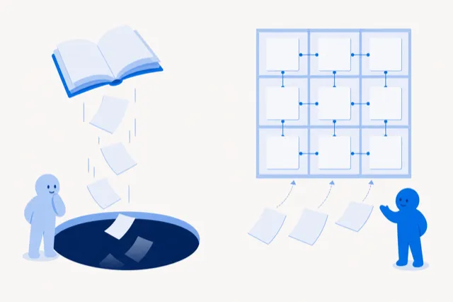

[Русский](README.md) · English

# jadlis-vault — the workplace: vault skeleton, `CLAUDE.md`, first day relaunch

Sub-step 6.1 of the handover route. A single skill, `/jadlis-vault:vault-setup`, turns an empty folder into a vault the agent can work with and carries you through to the first daily note.

## Why

An empty folder plus an installed Obsidian is not yet a system: the agent does not know where anything lives, and the person does not know where to put it. The most common way to bury such a system is not a structural mistake but silence — the skeleton gets laid out and never used.

The skill closes both gaps in one pass (tag `jadlis-vault--v1.0.1`):

- Lays out the folder skeleton: `Потребности/`, `Цели/`, `Периоды/День/`, `Знания/`, `AI/verif/`, `Система/`.
- Writes `CLAUDE.md` — the vault map and note conventions that Claude Code reads in every session.
- Installs the `hide-files` CSS snippet (you enable it in Obsidian by hand).
- Runs the first evening relaunch: three results of the day, up to 5 tasks for tomorrow, tomorrow's note ready.
- Keeps the handover journal at `Система/Передача/состояние.md`.

## What it looks like



<details>
<summary>What appears in the folder (synthetic example)</summary>

Folder names are Russian by design — the vault itself is written in Russian.

```text
My-vault/
├── CLAUDE.md
├── Потребности/
├── Цели/
├── Периоды/День/
│   ├── 2026-09-06.md      ← today, with results filled in
│   └── 2026-09-07.md      ← tomorrow, already waiting
├── Знания/{Входящие,Ресерчи}/
├── AI/verif/
├── Система/{Шаблоны,Файлы,Передача}/
└── .obsidian/snippets/hide-files.css
```

Tomorrow's note is created in the evening and already waits — there is nothing to launch in the morning:

```markdown
---
type: day
date: 2026-09-07
---

# 2026-09-07

## Задачи

- [ ] Agree the plan with the coach
- [ ] Finish the chapter and write down one takeaway

## Итоги

## Заметки
```

</details>

## Install

Paste this block to an agent in Claude Code opened in the vault folder:

```text
You are an installer. Do exactly these steps and nothing beyond them:
1. Bash: claude plugin marketplace add https://github.com/beCyborg/jadlis-start.git
2. Bash: claude plugin install jadlis-vault@jadlis
3. Tell me in one line: "Send /reload-plugins, then write: /jadlis-vault:vault-setup"
Do not read, create or install anything else.
```

The manual path is the same commands:

```bash
claude plugin marketplace add https://github.com/beCyborg/jadlis-start.git
claude plugin install jadlis-vault@jadlis
```

Then `/reload-plugins` and `/jadlis-vault:vault-setup`. On enable the plugin asks for `VAULT_PATH` — the path to the vault folder, `~/Jadlis` by default. The full HTTPS marketplace URL is required: the short `owner/repo` form expands to an SSH address, and a new user usually has no SSH key. The whole 6.1 sub-step can also be driven by the route driver: `JADLIS-BATCH 6`.

## Usage

Three typical scenarios:

1. **First pass** — `/jadlis-vault:vault-setup`. The skill checks what already exists and never overwrites an existing `CLAUDE.md`.
2. **Continue after Obsidian** — `/jadlis-vault:vault-setup`. If the folder was opened as a vault only after the first run, the skill delivers the missing `hide-files` snippet and leaves everything else alone.
3. **Check whether the sub-step is closed** — `JADLIS-BATCH статус`. Sub-step 6.1 is closed once `CLAUDE.md` exists **and** there is at least one note in `Периоды/День/`.

## Limits and cost

What the skill does not do, and what it needs:

- **It does not create the meaning note, metrics or goals.** That is `jadlis-interviewer` (sub-step 6.2); an empty placeholder here would only get in the way.
- **It never creates the folder silently.** If `VAULT_PATH` does not exist, the skill asks instead of guessing: notes written into the wrong place are the most expensive mistake of this step.
- **It does not touch `~/.claude/settings.json` and installs no other plugins.** The sub-step needs no API keys and no paid services at all.
- **Obsidian is optional.** With no `.obsidian` folder the skill skips only the CSS snippet and does everything else; the snippet is enabled by hand in Settings → Appearance → CSS snippets.
- **The rhythm is on you.** The skill runs the first evening relaunch; auto-collecting the day's facts from TickTick, Timing and Health Auto Export is out of scope and does not ship as a plugin yet.
